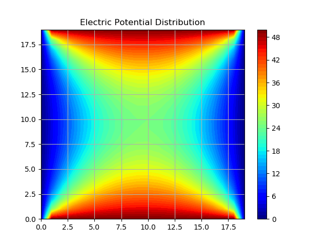
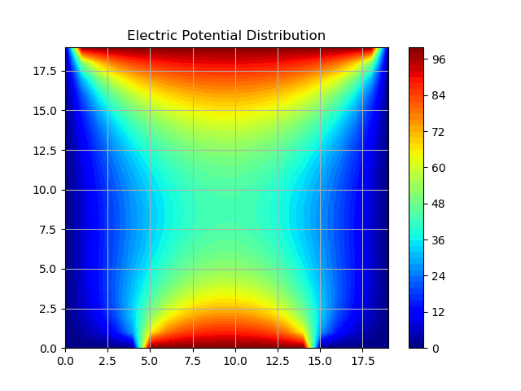

# Laplace
This was a computational assignment from my eletricity and magnetism course at the University of Guelph. It is a simple numerical iterative method for solving the laplace equation given boundary conditions.

